# Jedi-Training-Tracker
Jedi Training Tracker

```mermaid
graph TD
    A[Identificeer Force-gevoelig Individu] -->|ForceGevoeligIndividuGeïdentificeerd| B[Jedi Training Beginnen]
    B -->|JediTrainingBegonnen| C[Voltooi Proef Van Bekwaamheid]
    C -->|ProefVanBekwaamheidVoltooid| D{Is Geslaagd?}
    D -->|Ja| E[Ken Jedi Ridderschap Toe]
    D -->|Nee| F[Einde Training]
    E -->|JediRidderschapToegekend| G[Jedi Ridder]
```



Identificeer
```json
{
  "jediId": "lukeskywalker",
  "naam": "Luke Skywalker",
  "locatie": "Tatooine"
}
```
```json
{
  "jediId": "leiaorgana",
  "naam": "Leia Organa",
  "locatie": "Alderaan"
}
```
```json
{
  "jediId": "rey",
  "naam": "Rey",
  "locatie": "Jakku"
}
```

Begin training

```json
{
  "jediId": "lukeskywalker",
  "startDatum": "2023-11-16T09:00:00Z"
}
```
```json
{
  "jediId": "leiaorgana",
  "startDatum": "2023-11-17T09:00:00Z"
}
```
```json
{
  "jediId": "rey",
  "startDatum": "2023-11-18T09:00:00Z"
}
```

Voltooi proef

```json
{
  "jediId": "lukeskywalker",
  "proefType": "Lichtzwaard Duelleren",
  "isGeslaagd": true
}
```
```json
{
  "jediId": "leiaorgana",
  "proefType": "Piloten Proef",
  "isGeslaagd": false
}
```
```json
{
  "jediId": "rey",
  "proefType": "Piloten Proef",
  "isGeslaagd": true
}
```

Ridderschap 

```json
{
  "jediId": "lukeskywalker",
  "datumVanToekenning": "2023-11-19T09:00:00Z",
  "toegekendDoor": "yoda"
}
```
```json
{
  "jediId": "leiaorgana",
  "datumVanToekenning": "2023-11-20T09:00:00Z",
  "toegekendDoor": "obiwankenobi"
}
```
```json
{
  "jediId": "rey",
  "datumVanToekenning": "2023-11-21T09:00:00Z",
  "toegekendDoor": "lukeskywalker"
}
```